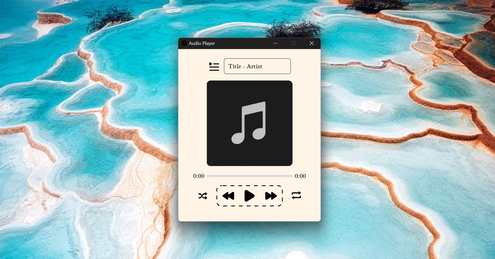

# Audio Player (Electron JS)

A cross-platform audio player built with Electron, supporting robust audio metadata extraction from both local tags and online sources (AcoustID/MusicBrainz). Displays title, artist, and cover art, with a support for Windows and Linux.

---

  ***⚠️ Warning:*** **This app is for educational purposes ONLY, Use this app for non-other than halal usage.**

## Features

- **Audio playback**
- **Metadata extraction**:
  - Local tags via [jsmediatags](https://github.com/aadsm/jsmediatags)
  - Online lookup via AcoustID/MusicBrainz (using fpcalc for fingerprinting)
- **Cover art** display (from local tags or [Cover Art Archive](https://coverartarchive.org/) )
- **Playlist/folder selection**
- **Offline fallback**: If online metadata is missing/incomplete, falls back to local tags
- **Works on Windows and Linux** (auto-selects correct fpcalc binary)
- **Linux RPM/DEB builds**: Uses `rpmbuild` and `@electron-forge/maker-rpm` for RPM packages (see below)

---

## Screenshot



---

## Getting Started

### Prerequisites

- [Node.js](https://nodejs.org/) (v18+ recommended)
- [Git](https://git-scm.com/)
- On Windows: No extra steps
- On Linux: Ensure `fpcalc` in `resources/bin/linux/` is executable (`chmod +x`)
- For Linux RPM builds: Install `rpmbuild` (see below)

### Install dependencies

```sh
npm install
```

### Run in development

```sh
npm start
```

### Build for your platform

- **Windows** (from Windows):

  ```sh
  npm run make
  ```

  Output: `out/make/` (installer `.exe`)

- **Linux** (from Linux or WSL):
  ```sh
  npm run make
  ```
  Output: `out/make/` (e.g., `.deb`, `.rpm`)

> **Note:** You cannot build Linux installers from Windows directly. Use WSL or a Linux machine for Linux builds.

#### Building RPM packages on Linux

- Make sure `rpmbuild` is installed:
  - On Ubuntu/Debian (WSL):
    ```sh
    sudo apt update && sudo apt install rpm
    ```
  - On Fedora/RHEL:
    ```sh
    sudo dnf install rpm-build
    ```
- Then run:
  ```sh
  npm run make
  ```
- The `.rpm` package will be in `out/make/`.

---

## Project Structure

```
resources/
  bin/win/fpcalc.exe      # Windows fingerprint binary
  bin/linux/fpcalc        # Linux fingerprint binary
  lib/jsmediatags.min.js  # Local jsmediatags build
src/
  index.html, renderer.js, preload.js, ...
  assets/                 # App icons and images
  metadata/               # Metadata extraction modules
forge.config.js           # Electron Forge config
package.json              # Project metadata and scripts
```

---

## Customization

- **App name & icon:**
  - Change `productName` in `package.json` for app name
  - Change `icon` and `setupIcon` in `forge.config.js` for app/installer icon
- **Metadata logic:**
  - See `src/metadata/` for local/online extraction logic

---

## License

MIT

---

## Credits

- [Electron](https://electronjs.org/)
- [jsmediatags](https://github.com/aadsm/jsmediatags)
- [AcoustID](https://acoustid.org/), [MusicBrainz](https://musicbrainz.org/)
- [Cover Art Archive](https://coverartarchive.org/)
